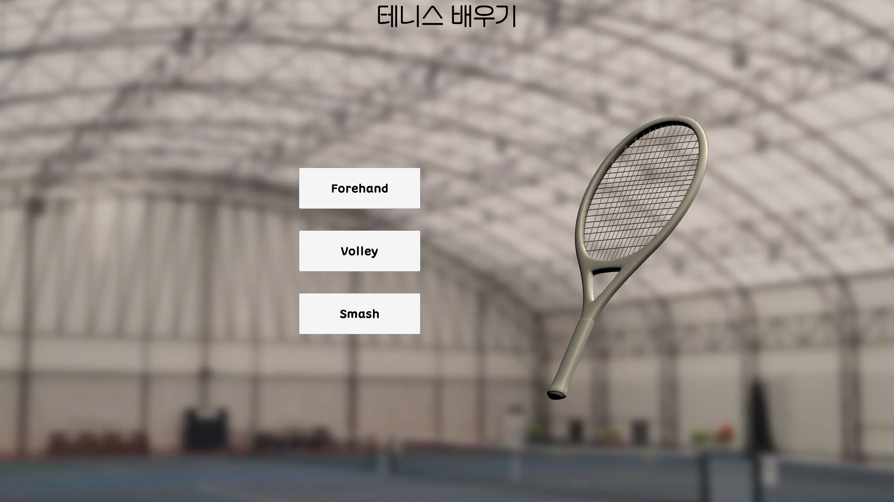
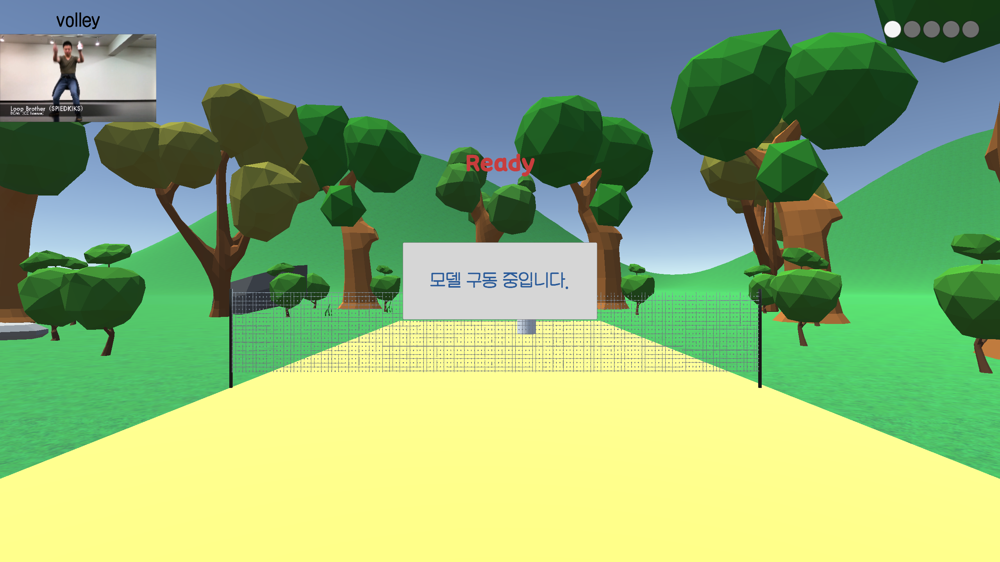
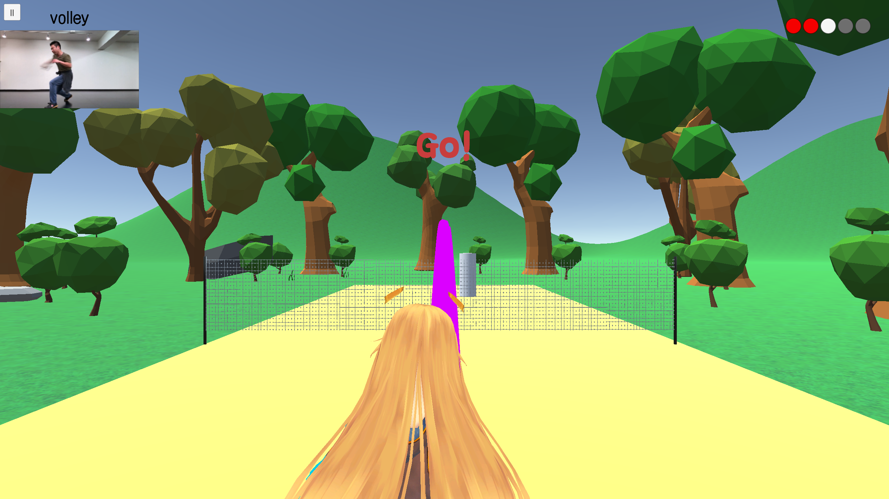
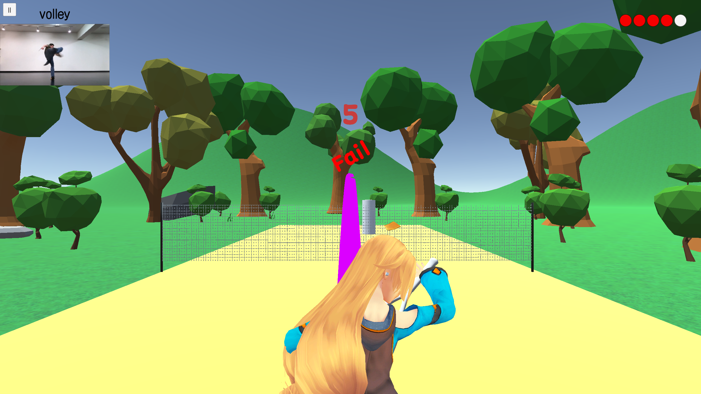
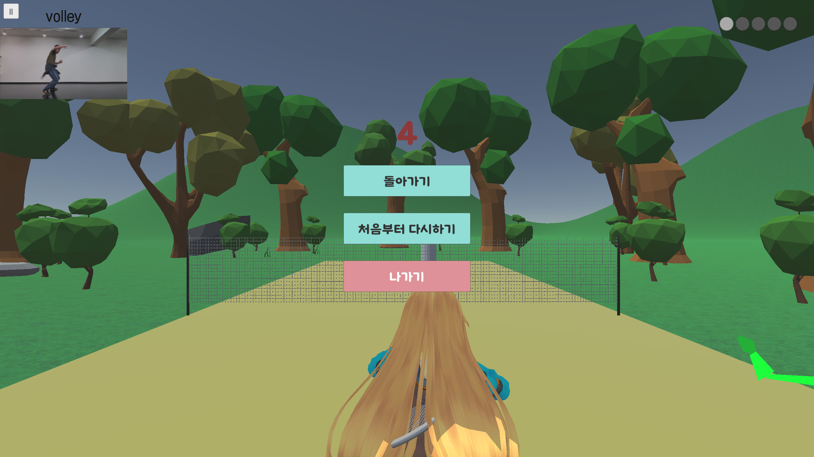

# 김민수 브랜치 (2023-12-05)

 
 

## 1. LobbyScene 
 
 

- 3D 테니스 채가 돌아갑니다.
- 연습 모드 버튼을 누르면 연습할 자세를 선택할 수 있습니다.
- 자세 선택 시 연습(Practice) 씬으로 이동합니다.
- 연습(Practice) 씬에서는 해당 자세를 연습할 수 있게 공이 날라갑니다.

### 사용된 스크립트 
GameManager.cs: 게임 전체를 관리합니다. 
LobbyManager.cs: 로비씬을 관리합니다. 
RotateRacket.cs: 3d 테니스 라켓 오브젝트를 돌립니다. 

## 2. PracticeScene 
 
 

- 현진님의 브랜치(공 던지기)를 바탕으로 하였습니다. 동영상과 연동한 결과입니다.(웹캠x)
- 공을 처음 던지는 시간은 모델 구동 이후입니다.
- 왼쪽 위: 일시정지 버튼과 자세 교정용 동영상입니다. 동영상에서는 현재 연습하고 있는 자세가 무엇인지 알려줍니다.
- 가운데 위: 공이 발사되기까지 남은 시간입니다.
- 오른쪽 위: 공의 총 발사 횟수이자 라운드입니다. 하얀색의 경우 현재 라운드, 빨간색의 경우 타격 실패, 초록색의 경우 타격 성공입니다.

### 사용된 스크립트 
PracticeManager.cs: 연습씬을 관리합니다. 
BallShooter.cs: 공을 발사합니다. (현진님 브랜치, 약간 수정) 
Ball.cs: 공의 타격 판정을 관리합니다. 공 오브젝트에 부착합니다. 
TrailRenderer.cs: 공의 궤적을 그립니다. 공 오브젝트에 부착합니다. 
RoundUIManager.cs: 라운드 UI를 그립니다. 

### 공 궤도 기능 
 

- 공이 날라간 궤도를 따라서 선이 생성됩니다.
- 궤도는 생성 후 1초 뒤에 사라집니다.(스크립트로 조절 가능)
- 궤도의 색깔은 TennisTrail(Materials)을 이용해 변경 가능합니다.
- 맵은 임시용입니다.

### 타격 판정 기능 
 

- 공이 라켓과 부딪치면 성공 판정이 됩니다.
- 공이 라켓과 부딪치기 전에 땅에 먼저 부딪치면 실패 판정이 됩니다.

### 일시정지 기능 
 

- 돌아가기: 게임 이어가기
- 처음부터 다시하기: 첫 시도부터 시작하기
- 나가기: 로비화면으로 나가기