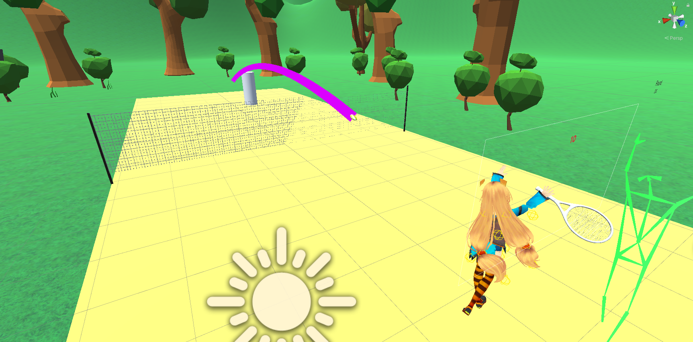

# 김민수 브랜치 (2023-12-04)

 
 

## 1. 현진님 브랜치 적용 
 

동영상과 연동한 결과입니다.(웹캠x) 
UI와 카메라 각도를 약간 수정하였습니다. 

## 2. 공 궤도 기능 추가 
 
사용된 스크립트
- TrailRenderer.cs (공 오브젝트에 부착)

기타
- TennisTrail(Materials)

공이 날라간 궤도를 따라서 선이 생성됩니다. 
궤도는 생성 후 1초 뒤에 사라집니다.(스크립트로 조절 가능) 
궤도의 색깔은 Materials을 이용해 변경 가능합니다. 

## 3. 로비 UI (유니티 연습) 
 
사용된 스크립트
- LobbyManager.cs

3D 테니스 채가 돌아갑니다. 
버튼을 누르면 다음 씬으로 이동합니다. 